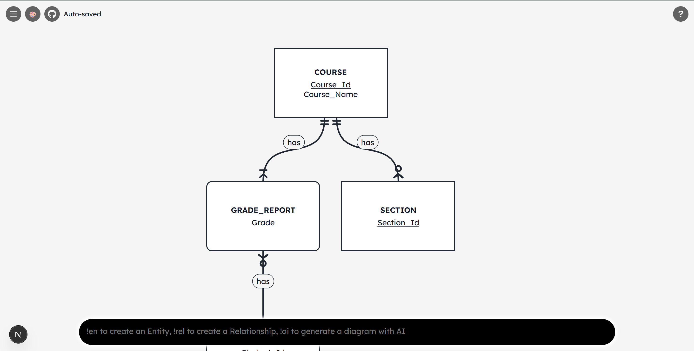

# QuickER



A fast, command-line inspired web application for creating Entity-Relationship (ER) diagrams. QuickER lets you build diagrams by typing commands in a prompt at the bottom of the screen, similar to a terminal—no point-and-click form filling required. It supports all standard ER constructs (strong, weak, and associative entities; supertype/subtype hierarchies; relationships with cardinalities), includes an AI-powered diagram generator, and convenient export options (PNG, PDF, custom code)!

## Description

QuickER is designed for rapid database modeling, prototyping, and teaching. You define entities and relationships using a concise text syntax, and the diagram renders in real time. The tool includes:

- **Drag-and-drop canvas** — Pan with middle-click, drag entities with left-click
- **In-place editing** — Double-click any entity or relationship label to edit names and attributes
- **Multiple colour palettes** — Choose from light, dark, and frosted glass themes
- **Export options** — Save diagrams as PDF, PNG, or diagram code (.txt)
- **AI generation** — Describe your domain in plain English and let the AI produce the ER diagram
- **Pretty Format** — Automatically arrange entities using a graph layout algorithm (Dagre)

Your diagram, colour palette, and first-visit status are stored in the browser so they persist across sessions.

## Technologies

| Layer | Technology |
|-------|------------|
| **Frontend** | Next.js 16, React 19, TypeScript |
| **Styling** | CSS Modules, Tailwind CSS |
| **Diagram rendering** | react-xarrows (SVG arrows), Dagre (layout) |
| **Export** | html-to-image, jsPDF |
| **Notifications** | react-hot-toast |
| **Icons** | react-icons |
| **Backend (API gateway)** | Express.js (Node.js) |
| **AI backend** | FastAPI (Python) |
| **State** | React hooks, localStorage |

---

## Command Documentation

All commands are entered in the prompt at the bottom of the screen and executed with **Enter**. Each command starts with a prefix (`!en`, `!rel`, or `!ai`).

---

### Entity Commands

**Syntax**
```
!en <name>[.<type>[.<options>]] [attributes]
```

| Part | Description |
|------|-------------|
| `name` | Entity name (e.g. `user`, `course`) |
| `type` | `strong` (default), `weak`, `assoc`, `super`, or `sub` |
| `options` | For `super`: `total`/`partial`, `disjoint`/`overlap`. For `sub`: parent entity name |
| `attributes` | Comma-separated list; see attribute prefixes below |

#### Attribute Prefixes

| Prefix | Meaning | Example |
|--------|---------|---------|
| `u.` | Primary key (underlined) | `u.id` |
| `du.` | Partial key (double underline) | `du.paymentNo` |
| *(none)* | Regular attribute | `name`, `email` |

#### Entity Type Examples

| Command | Description |
|---------|-------------|
| `!en user u.id, name, email` | **Strong entity** with primary key `id` and attributes |
| `!en payment.weak du.paymentNo, amount` | **Weak entity** with partial key `paymentNo` |
| `!en enrolment.assoc grade` | **Associative entity** (many-to-many linking table) |
| `!en vehicle.super.total.disjoint u.vin, type(d)` | **Super entity** — total participation, disjoint subtypes; `type(d)` is the discriminator |
| `!en person.super.partial.overlap u.NRIC, type(o)` | **Super entity** — partial, overlapping subtypes |
| `!en car.sub.vehicle numDoors` | **Sub entity** of `vehicle` |
| `!en bike.sub.vehicle gearCount` | Another sub entity of `vehicle` |

---

### Relationship Commands

**Syntax**
```
!rel <from> <card_to_from> <name> <card_from_to> <to> [type] { attrs }
```

| Part | Description |
|------|-------------|
| `from` | Source entity name |
| `card_to_from` | Cardinality from `to` toward `from` (appears at tail of arrow) |
| `name` | Relationship name |
| `card_from_to` | Cardinality from `from` toward `to` (appears at head of arrow) |
| `to` | Target entity name |
| `type` | Optional: `single` (default) or `double` (total participation) |
| `{ attrs }` | Optional: relationship attributes in curly braces, comma-separated |

#### Cardinality Codes

| Code | Meaning |
|------|---------|
| `11` | Exactly one |
| `01` | Zero or one |
| `0m` | Zero or many |
| `1m` | One or many |

#### Relationship Examples

| Command | Description |
|---------|-------------|
| `!rel student 0m enrols_in 0m course` | Many-to-many |
| `!rel department 1m has 11 employee` | One-to-many |
| `!rel employee 11 manages 01 department double` | One-to-one with total participation (double line) |
| `!rel student 0m takes 0m course {grade, semester}` | Many-to-many with attributes |
| `!rel employee 0m supervises 01 employee` | Unary (self-referencing) |

---

### AI Diagram Generation

**Syntax**
```
!ai <business rules in plain English>
```

Describe your domain, entities, and relationships in natural language. The AI will generate the corresponding ER diagram and add it to your canvas.

**Example**
```
!ai A university has students and courses. Students enrol in many courses; courses have many students. Each enrolment has a grade and semester. A department has many employees; each employee belongs to one department.
```

---

## Diagram Code File Format

When exporting or loading diagram code (.txt), the format uses two sections:

```
entities:
user u.id, name, email;
course u.code, title;
enrolment.assoc u.studentId, u.courseId, grade, semester;

relationships:
student 0m enrols_in 0m course {grade, semester};
department 1m has 11 employee;
```

- **entities:** — One entity per line, ending with `;`
- **relationships:** — One relationship per line, ending with `;`

You can load a diagram by dragging a `.txt` file onto the canvas or via **Settings → Load Diagram Code**.
